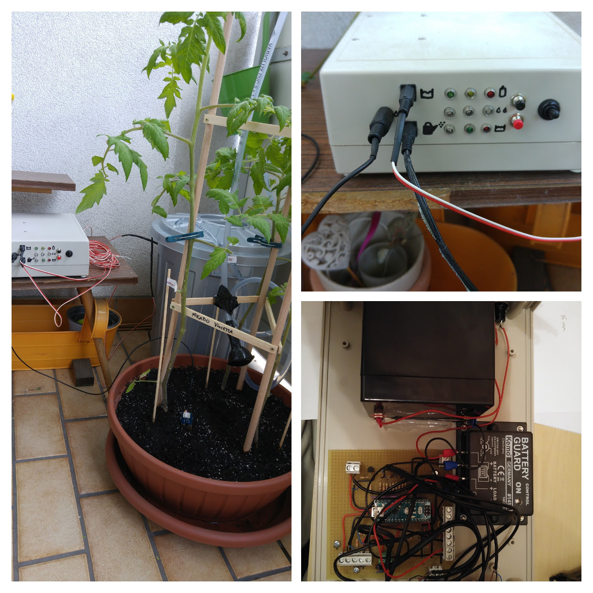
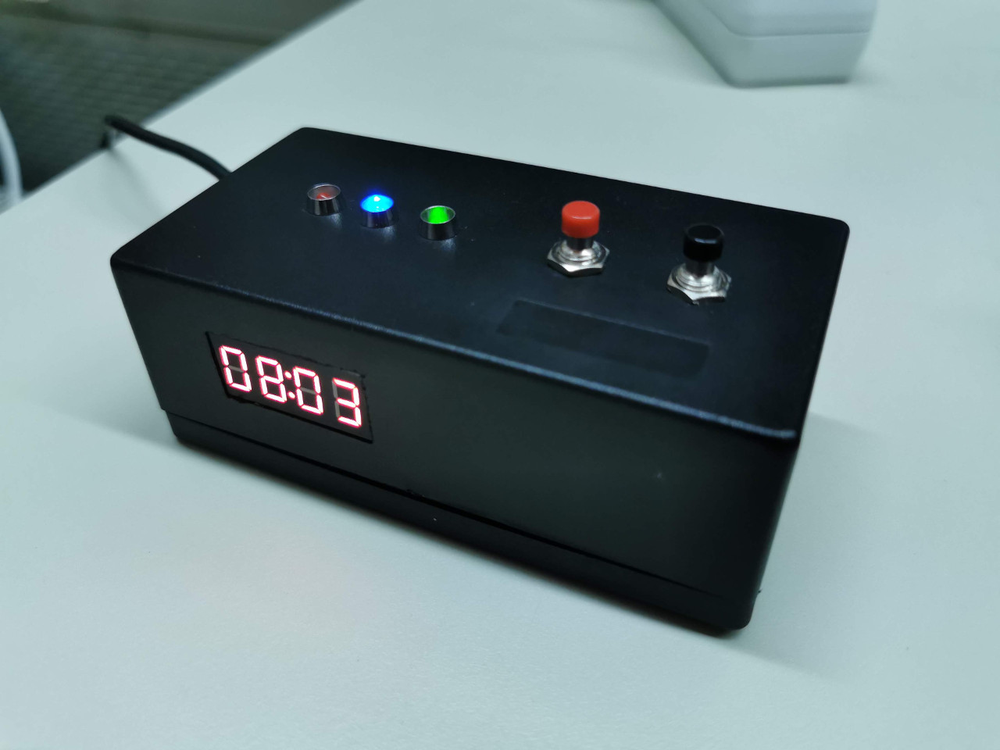

# Tinkering with Arduinos
Some of my tinkering projects using Arduinos.
Previously, this repository also hosted an Arduino library which is now available at https://github.com/snototter/BasicTinkering.

## Garduino: Automated Plant Watering
* A low-power tinkering project to water my tomatoes and chili plants.
* Only useful to lookup stuff on interrupts, watch dog timers, low-power consumption, setting/using ADC reference voltage, measuring battery levels, etc. This project doesn't build currently (need to find out proper versions -- should be around 2016/2017 -- of external libraries).
* Recovered the source from an older disk backup. Will definitely take some time before I get around to fix it/redeploy it (hopefully next gardening season).

## Session Chair's Stop Watch
* A stop watch for session chairs (and speakers) to keep an eye on/measure presentation time.
* Shows the presentation time, notifies speakers of their last X minutes (notification LED) and goes crazy (flashing LEDs) once they exceed their allocated slot.
* Implemented using an Arduino Nano (ATmega168).

