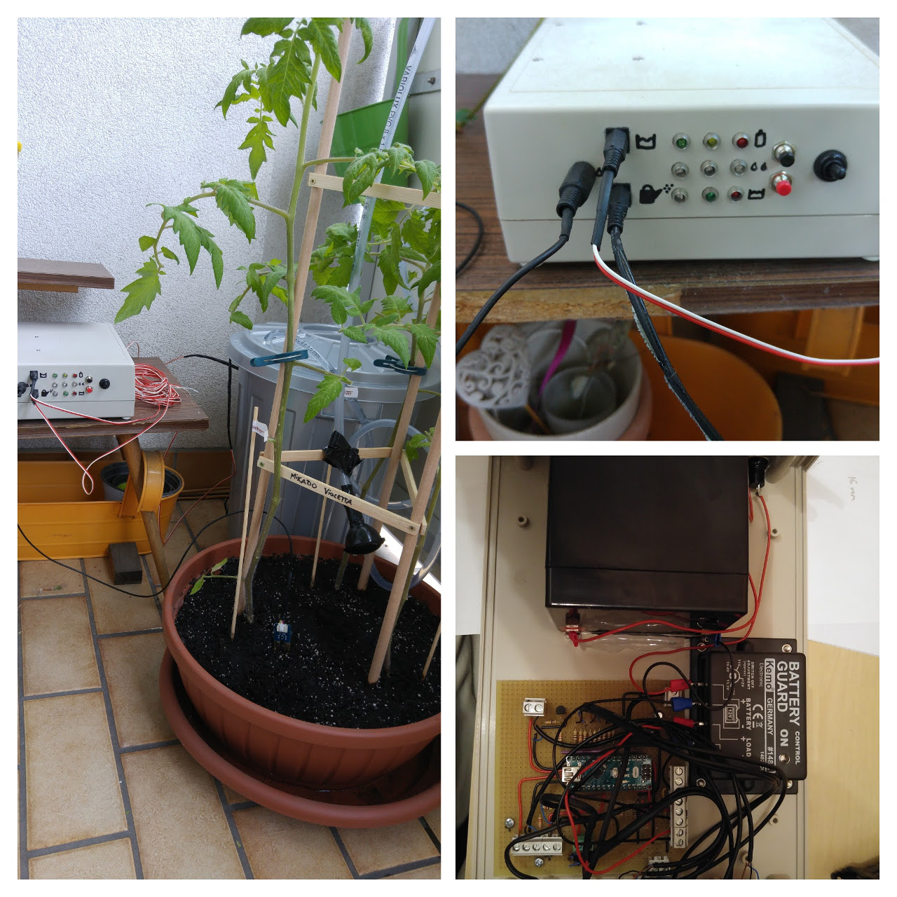
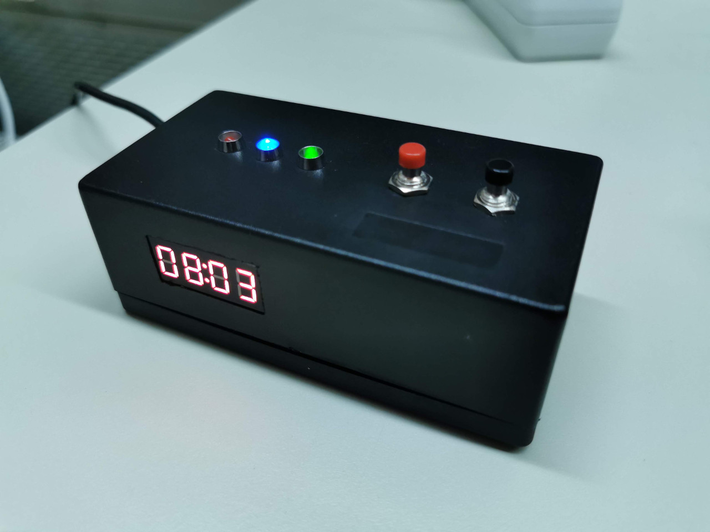

# Tinkering with Arduino
Tinkering projects using Arduino. This repository consists of custom libraries and some of my projects.

# BasicTinkering Library
A collection of wrappers for commonly used electronic components. Quite useful for tinkering and keeping embedded code maintainable. Includes wrappers for:
* `Button` - software-debounced push-buttons/triggers.
* `LED` - standard on/off plus blinking/fading capabilities (if LED is wired to a PWM-enabled pin).
* `Potentiometer` - allows binning the potentiometer value.
* `SevenSegmentDisplay` - 7-segment display wrappers currently supporting `TM1637` (4-digit) digital tubes.
* `StopWatch` - measures time.

# Tinkering Projects
Deployable tinkering projects.

## Automated Plant Watering
* A low-power tinkering project to water my tomatoes and chili plants.
* Source at `projects/Garduino`.

TODO (check disk backup for ino files)

## Session Chair's Stop Watch
* A stop watch for session chairs to time presentations, notify speakers of their last X minutes and go crazy once they exceed their allocated slot.
* Source at `projects/SessionChairWatch`.

